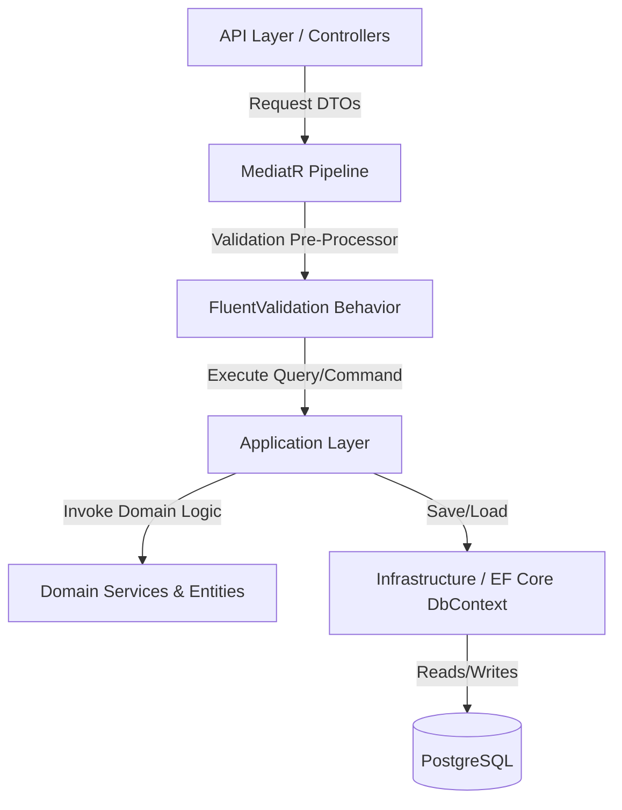

# 🌊 Seadora Travel — Architectural Findings & Implementation Plan

> [!IMPORTANT]
> **Target Agent**: This document is formatted as a task brief and implementation plan specifically for the **`senior-backend-developer`** agent. 
> When running the next session, load the `senior-backend-developer` agent (e.g., via `agy --agent senior-backend-developer`) to execute the refactoring steps outlined here.

This document details the architectural findings, gaps, and a comprehensive refactoring plan for the Seadora Travel microservices platform. The plan is designed to transition the codebase to be fully optimized using **Clean Architecture**, **SOLID principles**, the **DRY pattern**, and the **Factory pattern** for maximum extendability and maintainability.

---

## 1. Executive Summary

Seadora Travel consists of a decoupled microservices platform (Identity, Content, Booking, FileServer) behind a YARP API Gateway and two Vue 3 Single Page Applications (Customer and Admin). While the codebase implements a basic 4-layer separation of concerns, it suffers from critical persistence issues, data-leakage across architectural boundaries, inconsistent CQRS adoption, and unimplemented business policies.

---

## 2. Key Findings & Structural Gaps

### 2.1 Database Persistence & Schema Evolution
> [!CAUTION]
> **Destructive Re-creation on Startup**
> All microservices currently use `DbContext.Database.EnsureDeletedAsync()` followed by `EnsureCreatedAsync()` on application startup. This wipes all database tables and seeds them fresh, making production deployment or persistent user data impossible.
- **Root Cause**: Lack of EF Core Migrations configuration.
- **Impact**: Zero data persistence across service container restarts.

### 2.2 Boundary Leakage & Serialization Cycles (Content Service)
- **Root Cause**: The API Controllers in the `Content.Service` return Domain Entities (e.g., `Tour`, `Destination`, `Category`) directly.
- **Impact**:
  - Direct leakage of domain rules and internal structures to clients.
  - Serialization circular references (e.g., `Tour` references `Destination`, which references `Tours`) are patched using `ReferenceHandler.IgnoreCycles` instead of mapping to clean DTOs.
  - Tight coupling of database schemas to the API contract.

### 2.3 Inconsistent Pattern Application (CQRS & Validation)
- **Identity Service**: Validation pipelines are defined but commented out in the dependency registration.
- **Content Service**: Inconsistent CQRS flow. The `CategoriesController` queries the `ContentDbContext` directly to fetch data, while the `ToursController` and `DestinationsController` route queries through MediatR.
- **Booking Service**: Validations are written as inline conditionals inside MediatR command handlers, violating the Single Responsibility Principle and duplicating check patterns.

### 2.4 commented-out Business Rules & Domain Design
- **Cancellation Policy**: The `CancellationPolicyService` contains correct refund percentage calculations, but the implementation is commented out and not registered in DI.
- **Status Management**: Booking status is managed via magic strings (`"Pending"`, `"Confirmed"`, `"Cancelled"`), preventing the use of state-safety or clean transition patterns.
- **Cash Reservation Expiry**: The policy to auto-cancel cash bookings 48 hours before the tour date is commented out and lacks a scheduling engine (e.g., BackgroundWorker or Quartz) to run the checks.

---

## 3. Core Architectural Patterns to Enforce



### 3.1 Clean Architecture (Strict Boundaries)
- **Rule**: Domain Entities must never cross the Application boundary. Every endpoint response must be mapped to a dedicated **DTO (Data Transfer Object)**.
- **Benefit**: Ensures API contracts are decoupled from database structures.

### 3.2 SOLID Principles
- **S (Single Responsibility)**: Remove inline validation logic from MediatR Handlers. Move validations to dedicated FluentValidation classes processed in a pipeline behavior.
- **O (Open/Closed)**: Extend booking payment and status behaviors without modifying existing controllers.
- **D (Dependency Inversion)**: Register all Domain Services (`ICancellationPolicyService`) and Infrastructure Adapters through DI containers using interfaces.

### 3.3 DRY (Don't Repeat Yourself) Pattern
- **Pipeline Behaviors**: Standardize validation, error logging, and correlation ID extraction into MediatR pipeline behaviors instead of duplicate middleware or try-catch blocks in handlers.
- **Localization Handling**: Standardize localized JSON dictionary parsing (`Dictionary<string, string>`) across the Content service.

### 3.4 Factory Pattern
- **Storage Factory**: Enhance `LocalStorageService` and `RemoteStorageService` resolution via a runtime storage factory.
- **Refund Policy Factory**: Introduce a factory to resolve the appropriate refund policy based on the booking's payment method or trip type.

---

## 4. Phase-by-Phase Implementation Plan

### Phase 1: Persistence & EF Core Migrations (Infrastructure)
1. Remove all startup destructive creation commands (`Database.EnsureDeleted()`) from `Program.cs` and `DependencyInjection.cs` across all services.
2. Initialize and configure EF Core Migrations for:
   - `Seadora.Identity.Infrastructure`
   - `Seadora.Content.Infrastructure`
   - `Seadora.Booking.Infrastructure`
3. Create initial migration files and configure automated migration execution on startup (`DbContext.Database.MigrateAsync()`).

### Phase 2: Boundary Separation & DTOs (Clean Architecture & SOLID)
1. Introduce request and response DTOs for all endpoints in `Content.Service` and `Booking.Service`.
2. Implement strongly-typed mappers (e.g., using Mapster or manual mapper profiles) to map Domain Entities to DTOs in the Application layer.
3. Align all controllers in `Content.Service` to route queries exclusively via MediatR (removing direct context injection from `CategoriesController`).

### Phase 3: Validation & Logging Pipeline (DRY & SOLID)
1. Uncomment and configure FluentValidation in `Identity.Service`.
2. Add FluentValidation pipelines to `Booking.Service` and `Content.Service`.
3. Implement a generic MediatR `ValidationBehavior<TRequest, TResponse>` in `Seadora.Common` to intercept requests, run validators, and throw validation exceptions uniformly.
4. Implement a global exception handling middleware in `Seadora.Common` to format API validation errors consistently (e.g., RFC 7807 Problem Details).

### Phase 4: Business Rules Activation (Booking Domain & Factory)
1. Convert `Booking.Status` from magic strings to a strongly-typed `BookingStatus` enum.
2. Activate and wire `ICancellationPolicyService` in `Booking.Service`.
3. Create a `RefundProcessorFactory` to resolve the refund amount calculations dynamically:
   ```csharp
   public interface IRefundProcessor
   {
       decimal CalculateRefund(Booking booking, decimal totalCost, DateTime cancellationTime);
   }
   ```
4. Implement `CashRefundProcessor` and `OnlineRefundProcessor` via the factory.
5. Create an `IHostedService` background worker running every hour in the Booking Service to search for, cancel, and log pending cash reservations within the 48-hour window.
