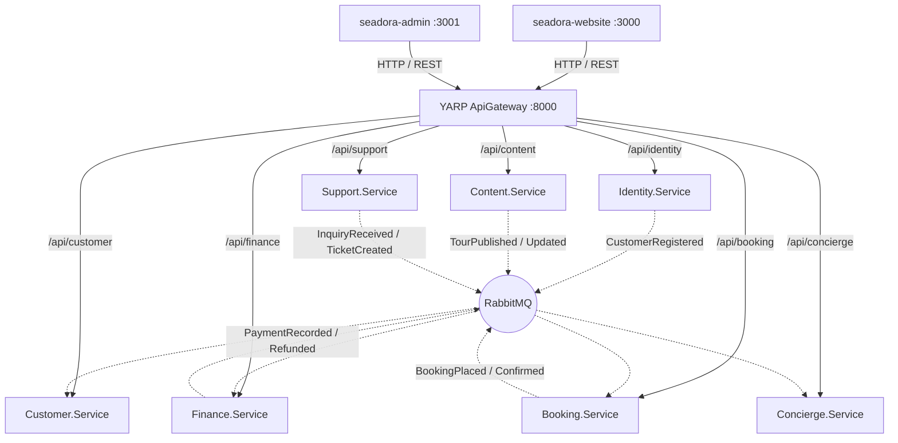

# 🌊 Seadora Travel — Codebase Memory & Identification

> **Purpose**: This file serves as a living reference document for the Seadora Travel codebase.
> It is the single source of truth for understanding the system architecture, current state,
> and known issues. **Update this file whenever changes are made.**

> **Last Updated**: 2026-08-28

---

## Table of Contents

1. [Project Overview](#1-project-overview)
2. [Workspace Layout](#2-workspace-layout)
3. [Technology Stack](#3-technology-stack)
4. [Architecture Overview](#4-architecture-overview)
5. [Microservices Backend](#5-microservices-backend)
   - [5.1 Identity Service](#51-identity-service)
   - [5.2 Content Service](#52-content-service)
   - [5.3 Booking Service](#53-booking-service)
   - [5.4 Customer CRM Service](#54-customer-crm-service)
   - [5.5 Finance & Ledger Service](#55-finance--ledger-service)
   - [5.6 Support & Service Desk](#56-support--service-desk)
   - [5.7 Concierge AI Service](#57-concierge-ai-service)
   - [5.8 File Server](#58-file-server)
6. [Shared Libraries: Seadora.Common & Seadora.Contracts](#6-shared-libraries-seadoracommon--seadoracontracts)
7. [API Gateway (YARP)](#7-api-gateway-yarp)
8. [Web Frontends](#8-web-frontends)
   - [8.1 Customer Website & VIP Portal](#81-customer-website--vip-portal)
   - [8.2 Admin Operations Dashboard](#82-admin-operations-dashboard)
9. [Docker Compose Topology (13 Services)](#9-docker-compose-topology-13-services)
10. [Business Rules & Workflows](#10-business-rules--workflows)
11. [Seed Data & Test Credentials Reference](#11-seed-data--test-credentials-reference)
12. [Change Log](#12-change-log)

---

## 1. Project Overview

| Field | Value |
|---|---|
| **Brand Name** | Seadora Travel (SeeDora Travel) |
| **Business** | Luxury Egyptian travel agency & experiential concierge |
| **Base** | Hurghada, Red Sea, Egypt |
| **Target Audience** | European & International travellers (EN, DE, IT, FR, RU) |
| **Phone** | +20 106 894 0967 |
| **Email** | info@seadoratravel.com |
| **Languages** | English (`en`), German (`de`), Italian (`it`), French (`fr`), Russian (`ru`) |

---

## 2. Workspace Layout

```
D:\Seadora Travel\
├── index.html                          # Legacy static marketing landing page
├── CODEBASE_MEMORY.md                  # ← This living documentation file
├── BUSINESS_LOGIC.md                   # Enterprise business rules & policies
├── ARCHITECTURAL_FINDINGS.md           # Architecture audit & decisions
│
└── seadoratravel\                      # Microservices platform root
    ├── SEADORA.sln                     # Complete solution (all microservices & tests)
    ├── docker-compose.yml              # 13-service Docker compose topology
    │
    ├── src\
    │   ├── ApiGateway\                 # YARP reverse proxy (port 8000)
    │   │   └── Seadora.ApiGateway\
    │   │
    │   ├── Services\
    │   │   ├── Common\
    │   │   │   ├── Seadora.Common\     # Shared kernel (Outbox, Idempotency, Tenancy, Polly)
    │   │   │   └── Seadora.Contracts\  # Integration event records (RabbitMQ MassTransit)
    │   │   │
    │   │   ├── Identity.Service\       # Auth, RBAC, Customer Registration & WhatsApp OTP
    │   │   ├── Content.Service\        # Tour Catalog, Categories, Destinations, Policies
    │   │   ├── Booking.Service\        # Departures, Concurrency lock, Booking Aggregate
    │   │   ├── Customer.Service\       # CRM, Profile, Booking Projections, Customer Portal API
    │   │   ├── Finance.Service\        # Double-entry ledger, Chart of Accounts, 9 Financial Reports, Owner KPIs
    │   │   ├── Support.Service\        # Tickets, Threaded conversations, SLAs, Customer & Admin APIs
    │   │   ├── Concierge.Service\      # Grounded AI Chatbot, Catalog embeddings index, Human Handoff
    │   │   └── FileServer\             # Document & media storage
    │   │
    │   └── Web\
    │       ├── seadora-website\        # Vue 3 SPA (Port 3000) - Luxury Website & VIP Customer Portal
    │       └── seadora-admin\          # Vue 3 SPA (Port 3001) - Operations, CRM, Finance, Support Desk
    │
    ├── docs\
    │   └── superpowers\plans\          # Multi-phase execution plans
    │
    └── tests\                          # xUnit test suites across all domains
```

---

## 3. Technology Stack

- **Backend Framework**: .NET 9.0 (C# 13)
- **Database & Persistence**: PostgreSQL 16, Entity Framework Core 9 (Code-First Migrations, Outbox pattern, Idempotency tracking)
- **Messaging & Event-Driven Bus**: RabbitMQ 3.13 + MassTransit 8 (Transactional Outbox & Deduplication)
- **API Gateway**: Microsoft YARP Reverse Proxy with Polly Resilience & CORS
- **Frontends**: Vue 3 (Composition API), Vite 8, Pinia, Vue Router 4, Vue I18n 11, Tailwind CSS, Motion-v, Chart.js, Lucide Icons

---

## 4. Architecture Overview

The system employs a **decoupled, event-driven microservices architecture** where each bounded context owns its schema and publishes domain/integration events via the **Transactional Outbox Pattern**:



---

## 5. Microservices Backend

### 5.1 Identity Service (`Seadora.Identity`)
- **Responsibilities**: User authentication, JWT tokens, RBAC permissions, Customer self-registration, WhatsApp OTP.
- **Key Endpoints**:
  - `POST /api/auth/login`
  - `POST /api/auth/register-customer`
  - `POST /api/auth/whatsapp/send-otp` / `POST /api/auth/whatsapp/verify-otp`
  - `GET /api/users` & `PUT /api/users/{id}/roles`

### 5.2 Content Service (`Seadora.Content`)
- **Responsibilities**: Tour catalog, destinations, categories, tour type pricing models (PerPerson vs FlatGroup), allocation policies.
- **Key Endpoints**:
  - `GET /api/destinations`, `GET /api/categories`, `GET /api/tours`
  - `POST /api/tours` (Admin), `PUT /api/tours/{id}`, `DELETE /api/tours/{id}`

### 5.3 Booking Service (`Seadora.Booking`)
- **Responsibilities**: Departures availability, optimistic concurrency locks, guest room manifests, booking lifecycle state machine (`Pending`, `Confirmed`, `Completed`, `Cancelled`).
- **Key Endpoints**:
  - `POST /api/bookings` (Place booking)
  - `GET /api/bookings/{id}`
  - `PUT /api/bookings/{id}/status`

### 5.4 Customer CRM Service (`Seadora.Customer`)
- **Responsibilities**: Customer profiles, loyalty tiers, booking history projections, document storage, Customer Portal endpoints.
- **Key Endpoints**:
  - `GET /api/customer/portal/me` & `PUT /api/customer/portal/me`
  - `GET /api/customer/portal/bookings`
  - `GET /api/customer/portal/documents`

### 5.5 Finance & Ledger Service (`Seadora.Finance`)
- **Responsibilities**: Double-entry bookkeeping, Chart of Accounts, Journal entries, Payments subledger, 9 Accountant Financial Reports, Business Owner KPIs.
- **Key Endpoints**:
  - `GET /api/finance/dashboard/kpis` & `GET /api/finance/dashboard/revenue-trend`
  - `GET /api/finance/reports/{reportType}` (Trial Balance, P&L, Balance Sheet, Cash Flow, Tax VAT, Tour Margin, Accounts Receivable, Currency Exposure)

### 5.6 Support & Service Desk (`Seadora.Support`)
- **Responsibilities**: Customer tickets, threaded conversation timeline, SLA response countdown, multi-channel intake (Web, Email, Chat, WhatsApp).
- **Key Endpoints**:
  - `POST /api/support/api/tickets/customer` (VIP request / complaint creation)
  - `GET /api/support/api/tickets/my` (Customer ticket list)
  - `POST /api/support/api/tickets/customer/{id}/reply`
  - `GET /api/support/api/tickets` (Admin queue with filters)

### 5.7 Concierge AI Service (`Seadora.Concierge`)
- **Responsibilities**: Grounded AI conversation engine, real-time tour suggestions, intent matching, human concierge handoff.
- **Key Endpoints**:
  - `POST /api/chat`
  - `POST /api/handoff`

---

## 6. Shared Libraries: Seadora.Common & Seadora.Contracts

- **`Seadora.Common`**:
  - `Messaging`: MassTransit configuration, transactional `OutboxMessage`, `IEventPublisher`.
  - `Idempotency`: `IProcessedMessageDbContext` preventing duplicate event processing.
  - `Tenancy`: Multi-branch scoping via `BranchId`.
  - `Middlewares`: Global exception handling returning RFC 7807 ProblemDetails.
- **`Seadora.Contracts`**:
  - `CustomerRegistered`, `TourPublished`, `TourUpdated`, `BookingPlaced`, `PaymentRecorded`, `InquiryReceived`, `TicketCreated`.

---

## 7. Web Frontends

### 7.1 Customer Website & VIP Portal (`seadora-website`) — Port 3000
- **Luxury Aesthetic**: Red Sea & Egyptian Gold (`#062d4d`, `#c9a84c`, `#f8fafc`).
- **Features**:
  - Multi-tab Auth Modal (`AuthModal.vue`): Email Login, Customer Registration with GDPR compliance, WhatsApp OTP, Password Reset.
  - Automatic Post-Login redirection to `/portal/dashboard`.
  - Customer Profile Dropdown (`CustomerProfileDropdown.vue`): User initials, VIP Guest tier badge, quick links to Profile, Documents, Support, and Logout.
  - Clean SEO Name Slugs in URL filters: `/tours?destination=hurghada`, `/tours?category=sea-diving`.
  - Full Customer Portal Suite (`/portal/**`):
    - `PortalDashboardView.vue`: Personalized welcome, trip countdown, quick action cards.
    - `PortalBookingsView.vue`: Active & past trips, payment breakdown, invoice download.
    - `PortalDocumentsView.vue`: Digital PDF vouchers and passport vault.
    - `PortalProfileView.vue`: Personal info & GDPR privacy toggles (Export Data / Delete Data).
    - `PortalSupportView.vue`: Bespoke VIP Concierge Request Modal (Yachts, Safaris, Flights) & Threaded conversation viewer.
  - Seamless "Return to Main Website" and "Book Experience" navigation.

### 7.2 Admin Operations Dashboard (`seadora-admin`) — Port 3001
- **Features**:
  - Executive Overview & KPI charts (`DashboardView.vue`).
  - Tour & Inventory Management (`ToursView.vue`, `DestinationsView.vue`, `CategoriesView.vue`, `TourTypesView.vue`).
  - Customer Care & Booking Processing (`BookingsView.vue`, `CustomersView.vue`, `CustomerDetailsView.vue`).
  - Finance Suite (`FinanceDashboardView.vue`, `FinanceReportsView.vue`, `FinancePaymentsView.vue`).
  - Service Desk (`SupportTicketsView.vue`, `TicketDetailsView.vue`).
  - User & Role Access Control (`UsersView.vue`, `RolesView.vue`).

---

## 8. Docker Compose Topology (13 Services)

| Container Name | Internal Service | Exposed Port | Purpose |
|---|---|---|---|
| `seadoratravel-seadora-website-1` | Website & Customer Portal | `3000:80` | Customer-facing SPA |
| `seadoratravel-seadora-admin-1` | Admin Operations Portal | `3001:80` | Backoffice management SPA |
| `seadoratravel-api-gateway-1` | YARP Reverse Proxy | `8000:8080` | Unified API Gateway |
| `seadoratravel-identity-service-1` | Identity.Service | Internal | Auth & RBAC API |
| `seadoratravel-content-service-1` | Content.Service | Internal | Catalog API |
| `seadoratravel-booking-service-1` | Booking.Service | Internal | Bookings API |
| `seadoratravel-customer-service-1` | Customer.Service | Internal | CRM & Portal API |
| `seadoratravel-finance-service-1` | Finance.Service | Internal | Ledger & Reports API |
| `seadoratravel-support-service-1` | Support.Service | Internal | Service Desk API |
| `seadoratravel-concierge-service-1` | Concierge.Service | Internal | Chatbot Engine API |
| `seadoratravel-file-server-1` | FileServer | Internal | File storage |
| `seadoratravel-postgres-1` | PostgreSQL 16 | `5432:5432` | Primary database cluster |
| `seadoratravel-backup-1` | Automated Backup | Internal | Scheduled DB dumps |

---

## 9. Seed Data & Test Credentials Reference

| Role | Email / Username | Password | Purpose / Default Access |
|---|---|---|---|
| **Super Admin** | `admin@seadora.com` | `Admin@123456` | Full platform administration (Admin Portal :3001) |
| **Business Owner** | `owner@seadoratravel.com` | `Owner123!` | Executive KPIs & financial overview (:3001) |
| **Lead Accountant** | `accountant@seadoratravel.com` | `Accountant123!` | Finance subledger & 9 financial reports (:3001) |
| **VIP Customer** | `customer@gmail.com` | `Customer123!` | Customer Portal & Booking self-service (:3000) |
| **New Traveler** | Any registered email | Selected on register | Auto-assigned `Customer` role via Website |

---

## 10. Change Log

| Date | Change Summary |
|---|---|
| **2026-08-28** | **Phase 2.5 Customer Portal & VIP Concierge Experience Deployed**: Full Vue 3 customer portal with luxury admin light aesthetic (`#F8FAFC`), i18n localization (EN, DE, IT, FR, RU), customer profile dropdown, bespoke VIP concierge request modal, interactive ticket details viewer, GDPR privacy checkboxes, SEO name slugs in URL filters, and "Return to Website" navigation. |
| **2026-08-28** | **Phase 4 Concierge AI Chatbot Service Implemented**: Built `Seadora.Concierge` service with grounded catalog indexing, MediatR intent scoring, and human handoff ticketing. Centered chatbot icon with smooth spring transitions. |
| **2026-08-28** | **Phase 3 Support / Service Desk Platform Implemented**: Built `Seadora.Support` microservice with CQRS ticket lifecycle, SLA monitoring, and backoffice support ticket desk in `seadora-admin`. |
| **2026-08-27** | **Phase 2 CRM & Finance Platform Implemented**: Built `Customer.Service` and `Finance.Service` with double-entry ledger, Chart of Accounts, 9 accountant financial reports, and Owner KPI dashboards. |
| **2026-08-26** | **Phase 0 & 1 Foundations & Bounded Contexts**: Added RabbitMQ, transactional outbox pattern, Money value object, and optimistic departure allocation locks. |
