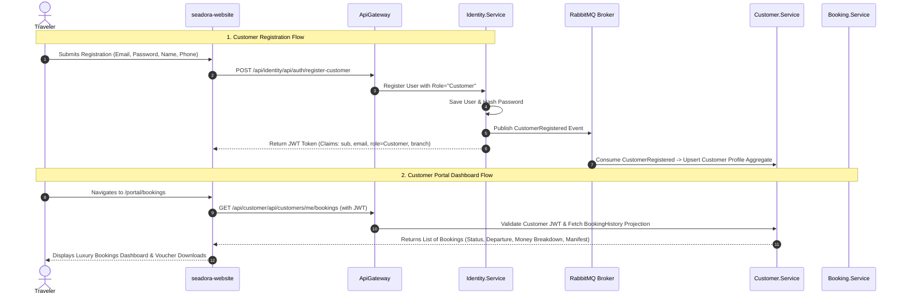

# Phase 2.5 — Customer Authentication & Website Customer Portal Plan

**Status:** Ready for Implementation  
**Owner:** Coordinator (Orchestrator) + Delegated Implementers (Backend & Frontend Leads)  
**Depends on:** Phase 2 (Customer CRM service), Identity Service RBAC, Booking Service Money & Projections, Support Service.  
**Tech Stack:** Vue 3 + Pinia + Tailwind (Website SPA), .NET 9 + EF Core (Identity & Customer Microservices), MassTransit + RabbitMQ.

---

## 1. Executive Summary & Goals

This plan specifies the end-to-end architecture and implementation for **Customer Authentication (Registration, Login, WhatsApp OTP)** and the **Customer Self-Service Portal** on the public website (`seadora-website`).

### Business Objectives:
1. **Frictionless Onboarding**: Enable travelers to register and login seamlessly via Email/Password, WhatsApp OTP, or Google OAuth.
2. **Customer Hub / Portal**: Provide a luxury personalized portal on `seadora-website` where customers can:
   - View **Active & Past Bookings** with live payment status and countdowns.
   - Access **Digital Boarding Vouchers & Travel Itinerary PDFs**.
   - Manage **Passenger Manifest Details** (Passport photos, dietary requirements, room numbers).
   - Track **Invoices & Receipts** with one-click payment settlement.
   - View and manage **Support Tickets & AI Concierge Transcripts**.
   - Update **Personal Profile & GDPR Marketing Consents**.

---

## 2. Target Architecture & Event Flows

---

## 3. Detailed Task Breakdown

### Backend Tasks (Identity, Customer, Booking Services)

#### Task 2.5: Customer Identity & Auth Endpoints (`Identity.Service`)
- **Files**:
  - `src/Services/Identity.Service/Seadora.Identity.Application/Authentication/Commands/RegisterCustomer/RegisterCustomerCommand.cs`
  - `src/Services/Identity.Service/Seadora.Identity.API/Controllers/AuthController.cs`
  - `src/Services/Common/Seadora.Contracts/Identity/CustomerRegistered.cs`
- **Deliverables**:
  - `POST /api/auth/register-customer` (Email, Password, FullName, PhoneNumber, BranchId).
  - Automatically assigns `Role = "Customer"`.
  - Publishes `CustomerRegistered` integration event via transactional outbox.
  - Generates JWT containing `role: Customer`, `branch`, `userId`, `email`.
  - Supports WhatsApp OTP verification via `POST /api/auth/verify-whatsapp-otp`.

#### Task 2.6: Customer Self-Service API (`Customer.Service`)
- **Files**:
  - `src/Services/Customer.Service/Seadora.Customer.Application/Customers/Queries/GetCustomerProfile/GetMyProfileQuery.cs`
  - `src/Services/Customer.Service/Seadora.Customer.Application/Customers/Commands/UpdateMyProfile/UpdateMyProfileCommand.cs`
  - `src/Services/Customer.Service/Seadora.Customer.Application/Customers/Queries/GetMyBookings/GetMyBookingsQuery.cs`
  - `src/Services/Customer.Service/Seadora.Customer.API/Controllers/CustomerPortalController.cs`
- **Deliverables**:
  - `GET /api/customer/portal/me` — Fetches current customer profile, contact details, consent flags.
  - `PUT /api/customer/portal/me` — Updates profile name, phone, preferences, marketing consent.
  - `GET /api/customer/portal/bookings` — Fetches customer's linked booking history with real-time status.
  - `GET /api/customer/portal/documents` — Fetches customer uploaded documents and vouchers.

---

### Frontend Tasks (`seadora-website`)

#### Task 2.7: Luxury Auth Modal & State (`seadora-website`)
- **Files**:
  - `src/features/auth/components/AuthModal.vue` (Enhanced multi-tab: Login, Register, WhatsApp OTP, Forgot Password)
  - `src/features/auth/store/auth.ts` (Pinia store handling customer session, token persistence, role verification)
  - `src/features/auth/api/authApi.ts` (Axios API calls for registration, login, logout, password reset)
- **Design Specifications**:
  - Emil Kowalski micro-interactions: smooth tab transition springs, floating field labels, live password strength meter, glassmorphic backdrop.
  - Seamless auto-redirect to `/portal` upon successful authentication.

#### Task 2.8: Customer Portal Hub & Views (`seadora-website`)
- **Files**:
  - `src/features/portal/layouts/CustomerPortalLayout.vue` (Luxury sidebar with user avatar, VIP tier badge, portal navigation)
  - `src/features/portal/views/PortalDashboardView.vue` (Overview of next upcoming departure, weather widget for destination, quick links)
  - `src/features/portal/views/PortalBookingsView.vue` (Interactive list of upcoming and past trips with itinerary download and payment status)
  - `src/features/portal/views/PortalBookingDetailView.vue` (Detailed booking receipt, interactive passenger manifest editor for room/passport details, cancellation actions)
  - `src/features/portal/views/PortalDocumentsView.vue` (Passport/ID on file, travel insurance, digital vouchers)
  - `src/features/portal/views/PortalProfileView.vue` (Personal details, concierge preferences, dietary requirements, GDPR toggles)
  - `src/features/portal/views/PortalSupportView.vue` (My tickets, chat history with Concierge, new inquiry button)
- **Routing**:
  - Registered `/portal`, `/portal/bookings`, `/portal/bookings/:id`, `/portal/documents`, `/portal/profile`, `/portal/support` in `src/router/index.ts` with navigation guard checking `authStore.isAuthenticated`.

---

## 4. Acceptance Criteria & Verification

1. **Registration & Login**:
   - Customer can register with valid credentials on the website; receives instant JWT token and is logged in.
   - `Customer.Service` receives `CustomerRegistered` event and creates a profile aggregate.
2. **Portal Navigation & Experience**:
   - Accessing `/portal` without login opens the `AuthModal.vue` with redirect memory.
   - Logged-in customer can view their bookings with exact `Money` breakdown (Total, Amount Paid, Balance Due).
   - Customer can update passport details and special requests for any of their bookings.
3. **Build & Quality**:
   - Zero errors on `dotnet build SEADORA.sln` and `npm run build` across both SPAs.
   - Meets Emil Kowalski UI polish and responsive layout guidelines.
